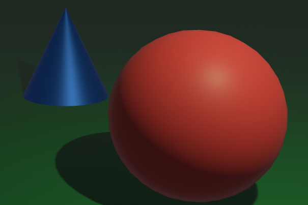
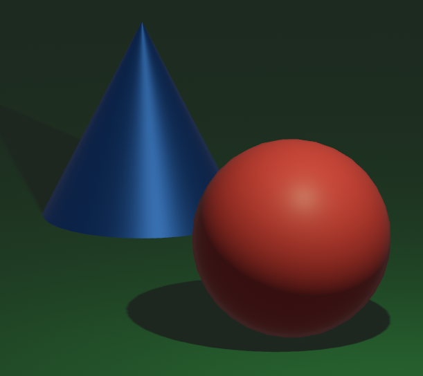

# Changing the projection

We can change the projection attached to the camera by simply providing a non-default `Projection` component:

```rust
# fn foo() {
commands.spawn((
    Camera3d::default(),
    Transform::from_xyz(0., 0.0, 1.0).looking_at(Vec3::ZERO, Vec3::Y),
    Projection::from(OrthographicProjection {
        scaling_mode: camera::ScalingMode::FixedVertical {
            viewport_height: 1.0,
        },
        ..OrthographicProjection::default_3d()
    }),
));
# }
```

In this case, we replace the default perspective projection with an orthographic one.

> With `orthographic` projection, objects do not appear smaller on the screen the further away from the
> camera they are. This is useful for CAD software etc., or if you want an isometric look to your game!

Perspective projection:


Orthographic projection:
