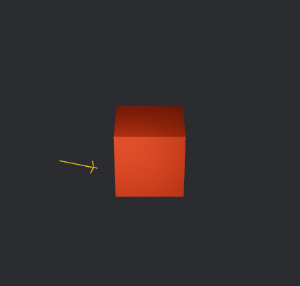

# Spawning the object

With the two resources at hand, we can finally spawn the object into our world:

```rust
commands.spawn((
    Mesh3d(cube_mesh_handle),
    MeshMaterial3d(material_handle),
    Transform::from_translation(Vec3::new(0.0, 0.5, 0.0))
));
```

